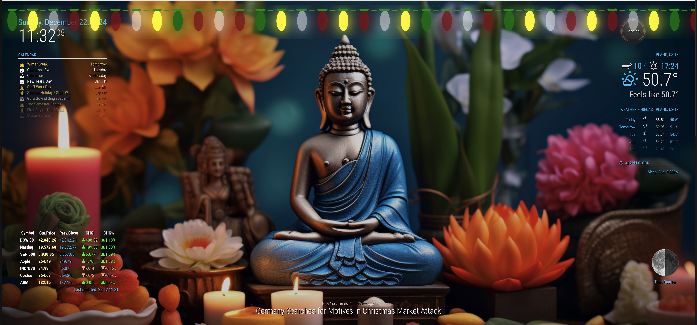
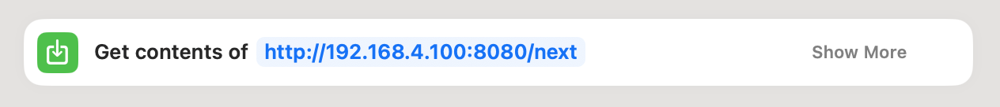
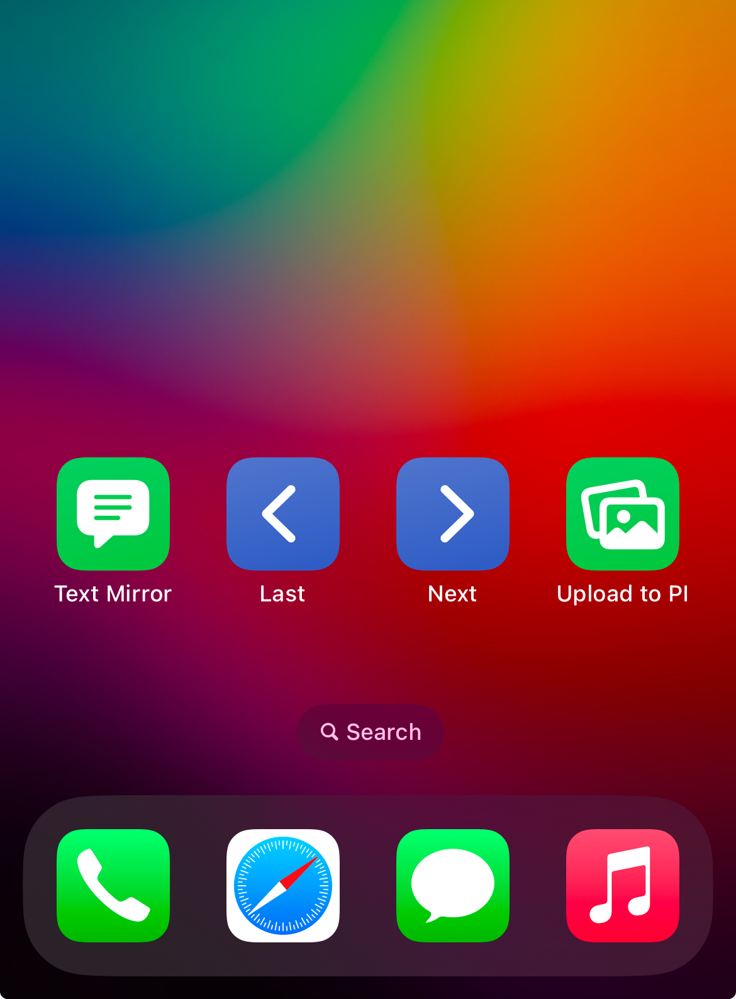
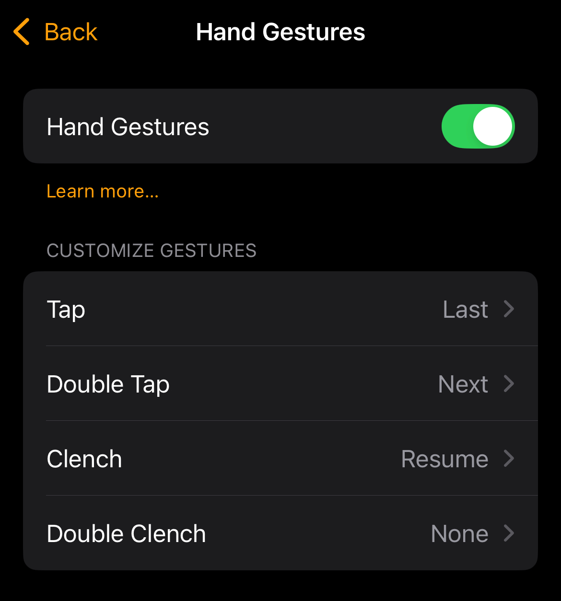

# MMM-Wallpaper



If you are using MagicMirror as a frame then you may use this light weight module to show a slideshow of wallpapers.

## Installation

### Install

In your terminal, go to your [MagicMirror²][mm] Module folder and clone MMM-Wallpaper:

```bash

cd ~/MagicMirror/modules
git clone https://github.com/sumitnsit/MMM-Wallpaper.git
```

### Copy Wallpaper
Copy your family images or wallpapers in `images` folder.

### Update

```bash
cd ~/MagicMirror/modules/MMM-Wallpaper
git pull
```

## Using the module

To use this module, add it to the modules array in the `config/config.js` file:

```js
{
    module: 'MMM-Wallpaper',
    position: 'fullscreen_below'
}
```

## Control Slideshow using API

Remote URL|Description
------|-----------
http://{IP Address}:8080/next| Loads next wallpaper and pauses the slideshow for 30 seconds
http://{IP Address}:8080/last| Loads previous wallpaper and pauses the slideshow for 30 seconds
http://{IP Address}:8080/resume | Resume the slideshow if you want it to resume before 30 seconds pause. 


### Control slide show using iPhone's Shortcuts

You can create shortcuts on iPhone's Shortcuts app to control the slideshow using your iPhone

- Create a new shortcut 
- Add `Get contents of` from actions and add URL for next/last/resume.



In the following example it creates 3 shortcuts


Place the shortcut on your home screen of iPhone like this.




## Use Apple Watch gestures to control wallpaper

Be a magician in font of MagicMirror and control wallpaper with your hand gestures.

Go to Settings > Accessibliity > AssistiveTouch > Hand Gestures 

Assign gestures to shortcuts created ealiear.

- Tap > Last
- DoubleTap > Next
- Clench > Resume


